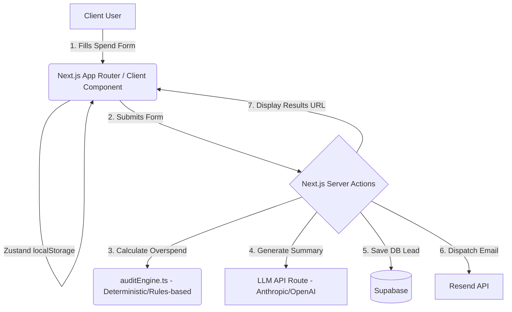

# Architecture & Technical Strategy

## 1. Stack Justification
- **Framework:** Next.js 14+ (App Router) - Provides native Server Actions for secure database writes and fast API routes perfect for Anthropic integration. Leverages React Server Components for achieving ≥85 Lighthouse mobile performance.
- **Styling UI:** Tailwind CSS + shadcn/ui - Modular styling achieving ≥90 Accessibility targets with zero-runtime CSS bloat.
- **State Management:** Zustand + localStorage - Lightweight persistence ensuring users don't drop their inputted spending configuration on accidental navigations, leading to higher conversion.
- **Database:** Supabase - Serverless PostgreSQL ideal for lead capture and maintaining audit reference URLs without requiring users to create accounts.
- **Email:** Resend - Fast, developer-friendly transactional emails for providing users their post-audit summary reports.

## 2. Infrastructure Diagram

## 3. Data Flow Overview
1. **Input:** User enters AI tool spending data block via `SpendInputForm`, validated strongly by `Zod` and auto-saved locally via `Zustand`.
2. **Processing:** The form payload hits out internal `auditEngine.ts`, comparing user inputs strictly against `PRICING_DATA.md` optimal threshold matrices.
3. **AI Enhancement:** The structured analytical difference is sent to our LLM endpoint solely to generate a highly personalized, natural language ~100-word financial summary wrapper with a fallback built-in.
4. **Capture:** The user's input, the deterministic audit result, and the generated summary are persisted via Supabase.
5. **Output:** User redirected to highly-performant `/audit/[id]` public route, and transactional summary email sent via Resend.

## 4. Scaling Architecture (10k Users/Day)
- **Static Caching:** The static elements of the audit pages will rely on Next.js ISR (Incremental Static Regeneration).
- **Abuse Prevention:** Implemented IP Rate limiting (Vercel KV or middleware base) mixed with an invisible honeypot on our frontend forms to prevent bot spam overloading LLM thresholds and our Supabase tables.
- **Pure Functions:** Heavy lifting math relies on edge-side lightweight Typescript functions (`auditEngine.ts`) taking load off network calls.
